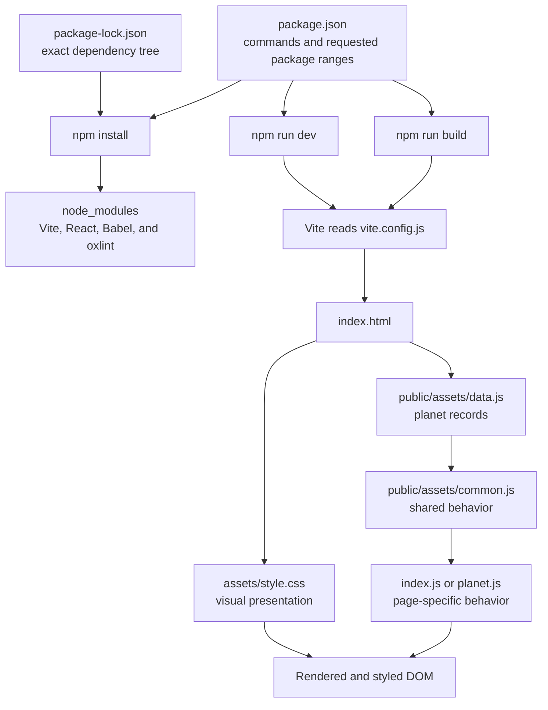

# Factonaut code walkthrough

This guide explains `package.json`, `package-lock.json`, `vite.config.js`, and the active `assets/style.css`, then traces how they connect to the HTML and JavaScript that create the website.

> The file is named `style.css`, not `css.style`. This repository contains multiple files with that name. The HTML source links to `assets/style.css`, so that is the active source stylesheet discussed here.

## The whole system at a glance



There are two separate layers:

1. The **development/build layer** is npm, `package.json`, `package-lock.json`, Vite, Babel, and the React plugins.
2. The **browser layer** is HTML, CSS, images, and the three classic JavaScript files loaded by each page.

The package files do not draw anything on the screen. They install and run the tools that serve or build the browser files.

## `package.json`, line by line

Real JSON cannot contain comments. The block below uses **JSONC** only for teaching; the real `package.json` must stay comment-free.

```jsonc
{ // Opens the single top-level project object.
  "name": "grp18website", // npm's machine-readable project name.
  "private": true, // Prevents an accidental `npm publish` of this student project.
  "version": "0.0.0", // The project's current semantic version: major.minor.patch.
  "type": "module", // Treats .js files in Node/Vite config as ES modules, enabling import/export.
  "scripts": { // Defines terminal shortcuts run as `npm run <name>`.
    "dev": "vite", // Starts Vite's local development server with automatic browser refresh.
    "build": "vite build", // Creates optimized production files in the dist directory.
    "lint": "oxlint", // Runs the configured JavaScript/JSX static-analysis checks.
    "preview": "vite preview" // Locally serves the already-built dist directory for a final check.
  }, // Ends scripts.
  "dependencies": { // Packages intended to be available to application/runtime code.
    "react": "^19.2.7", // React's component and state API; currently present in src but not loaded by the HTML pages.
    "react-dom": "^19.2.7" // Connects a React component tree to a browser DOM element; also currently disconnected.
  }, // Ends runtime dependencies.
  "devDependencies": { // Tools needed while developing/building, not by the deployed browser files themselves.
    "@babel/core": "^7.29.7", // The core engine that applies Babel transformations/presets.
    "@rolldown/plugin-babel": "^0.2.3", // Lets Vite's Rolldown pipeline send modules through Babel.
    "@types/react": "^19.2.17", // React type declarations for editors and TypeScript-aware tools.
    "@types/react-dom": "^19.2.3", // React DOM type declarations.
    "@vitejs/plugin-react": "^6.0.3", // Adds JSX handling and React Fast Refresh to Vite.
    "babel-plugin-react-compiler": "^1.0.0", // Optimizes compatible React component code at build time.
    "oxlint": "^1.71.0", // Fast JavaScript/JSX linter used by `npm run lint`.
    "vite": "^8.1.1" // Development server and production build tool.
  } // Ends development dependencies.
} // Closes the project object.
```

### Version syntax

`^8.1.1` is a **range**, not one exact version. For a normal package already at major version 1 or later, the caret permits compatible releases from `8.1.1` up to, but not including, `9.0.0`. The lockfile records the exact version npm selected from that range. That is why a command can report a newer compatible patch than the minimum written in `package.json`.

### What the scripts do in practice

| Command | Result |
| --- | --- |
| `npm install` | Reads both package files and creates/updates `node_modules`. |
| `npm run dev` | Runs Vite and serves the source files during development. |
| `npm run build` | Produces optimized files in `dist`. |
| `npm run preview` | Serves `dist`; it does not rebuild first. |
| `npm run lint` | Checks JavaScript/JSX using `.oxlintrc.json`. |

## `package-lock.json`, field by field

`package-lock.json` is generated by npm. It currently describes 113 installed package entries: the direct packages from `package.json` plus their transitive dependencies. It is long because packages such as Vite, Babel, React, and oxlint each depend on other packages.

Do not insert comments or manually maintain dependency blocks in this file. JSON comments would make it invalid, and a later `npm install` would regenerate manual edits. Commit the lockfile so every teammate and deployment installs the same dependency tree.

### Annotated opening block

```jsonc
{
  "name": "grp18website", // Repeats the root project's npm name.
  "version": "0.0.0", // Repeats the root project's version.
  "lockfileVersion": 3, // npm's version-3 lockfile data format.
  "requires": true, // States that this project uses dependencies.
  "packages": { // Maps install locations to exact package metadata.
    "": { // An empty path means the root Factonaut project itself.
      "name": "grp18website",
      "version": "0.0.0",
      "dependencies": { /* copied root runtime requirements */ },
      "devDependencies": { /* copied root development requirements */ }
    },
    "node_modules/@babel/code-frame": { // One installed transitive package and its location.
      "version": "7.29.7", // Exact selected version, unlike a caret range.
      "resolved": "https://registry.npmjs.org/...tgz", // Archive npm downloaded.
      "integrity": "sha512-...", // Checksum npm verifies before trusting the archive.
      "dev": true, // This package is present through the development toolchain.
      "license": "MIT", // Package's declared software license.
      "dependencies": { /* packages this package itself requires */ },
      "engines": { "node": ">=6.9.0" } // Supported Node.js version range.
    }
  }
}
```

### Every package-entry field used in this lockfile

| Field | Meaning |
| --- | --- |
| `name` | Package name. Usually needed explicitly only for the root entry. |
| `version` | Exact installed package version. |
| `resolved` | Registry archive URL used to retrieve the package. |
| `integrity` | Cryptographic hash used to detect corrupted or altered downloads. |
| `license` | License identifier declared by the dependency. |
| `dev` | `true` when the package is only needed through the development dependency tree. |
| `dependencies` | Packages this entry must have to work. Values are acceptable version ranges. |
| `devDependencies` | Root development tools copied from `package.json`. |
| `optionalDependencies` | Helpful packages whose installation may be skipped when unsupported. |
| `optional` | Marks this whole entry as optional. |
| `peerDependencies` | Packages that the consuming project/plugin is expected to supply alongside this package. |
| `peerDependenciesMeta` | Extra peer information; in this lockfile it mainly marks some peers as optional. |
| `engines` | Supported runtime versions, such as a minimum Node.js version. |
| `os` | Operating systems on which a platform-specific package can install. |
| `cpu` | CPU architectures supported by a platform-specific package. |
| `libc` | Supported C standard-library implementation for some Linux builds. |
| `bin` | Command names exposed in `node_modules/.bin`, such as `vite` or `oxlint`. |
| `funding` | One link or a list of links through which the package maintainers accept funding. |
| `hasInstallScript` | Warns npm that the package runs a lifecycle install script. |

Many optional blocks are platform binaries. For example, the lockfile records Windows, macOS, Linux, and other builds of tools such as oxlint and Rolldown. npm installs the one compatible with the current operating system and skips the others. This makes the lockfile portable across the whole team.

### How npm uses both package files

- `package.json` says **what the project accepts**, such as Vite `^8.1.1`.
- `package-lock.json` says **what npm selected exactly**, including every nested dependency and checksum.
- `node_modules` contains the installed code produced from that plan.
- If a dependency requirement changes, edit `package.json` through an npm command such as `npm install <package>`, and let npm update the lockfile.

## `vite.config.js`, line by line

The runnable file now contains safe JavaScript comments. Its logic is equivalent to this expanded explanation:

```js
// Import Vite's configuration helper.
import { defineConfig } from 'vite'

// Import the React integration and its React Compiler preset factory.
import react, { reactCompilerPreset } from '@vitejs/plugin-react'

// Import the adapter that can apply Babel inside Rolldown/Vite.
import babel from '@rolldown/plugin-babel'

// Give Vite one configuration object as this module's default export.
export default defineConfig({
  // Vite invokes these plugins in array order.
  plugins: [
    // Handle JSX and React Fast Refresh.
    react(),

    // Ask Babel to apply the React Compiler preset.
    babel({
      presets: [reactCompilerPreset()],
    }),
  ],
})
```

`react()`, `babel(...)`, and `reactCompilerPreset()` are **function calls**. Each returns configuration/plugin data that Vite uses. `defineConfig(...)` returns the final config while also helping editors understand its allowed fields.

The current pages do not import `src/main.jsx`, so the React/Babel pipeline is installed and configured but is not responsible for the visible Factonaut pages. The visible pages use normal HTML and classic JavaScript.

## `assets/style.css`, rule by rule

CSS has this general shape:

```css
.button {                 /* selector: finds elements whose class is button */
  background: var(--rust); /* declaration: property followed by its value */
}                         /* ends this rule */
```

When selectors are separated with commas, they share the declarations. A selector such as `.planet-card img` means “an `img` anywhere inside `.planet-card`.” A selector such as `.button.secondary` requires both classes on the same element. A selector such as `.rocket.launch` becomes active only after JavaScript adds `launch`.

### Design tokens and global rules

| Selector | Purpose |
| --- | --- |
| `:root` | Defines reusable `--name` custom properties for the paper, ink, accent colors, border, surfaces, and shadow. `var(--name)` reads them later. |
| `*` | Makes declared width/height include padding and border through `box-sizing: border-box`. |
| `html` | Smoothly scrolls to anchors such as `#planets`. |
| `body` | Removes browser margin; supplies page colors, serif type, line spacing, minimum height, and horizontal-overflow protection. |
| `img` | Prevents images from exceeding their containing element. |
| `a` | Inherits the surrounding text color instead of forcing the browser's default blue. |
| `button, a` | Removes the colored tap flash used by WebKit mobile browsers. |
| `button` | Makes controls use the site's inherited font. |
| `.container` | Centers content and limits it to `1160px` or `92%` of the viewport, whichever is smaller. |
| `.hidden` | Completely removes an element from layout. `!important` ensures the state beats ordinary display rules. |

### Header and home-page hero

| Selector | Purpose |
| --- | --- |
| `.site-header` | Flex row containing the logo and navigation with a dark background. |
| `.brand` and `.brand span` | Formats the Factonaut wordmark and colors its nested span. |
| `.nav-links` | Aligns navigation items in one row. |
| `.nav-links a, .sound-toggle` | Makes links and the sound control look like matching text controls. |
| Hover/focus selectors for navigation | Change color for mouse and keyboard feedback. |
| `.hero` | Two-column grid for introductory copy and the mission transmission. It is the positioning parent for the rocket. |
| `.eyebrow` | Small uppercase section label. |
| `.main-title, .planet-title` | Shared oversized, responsive heading rule using `clamp()`. |
| `.tagline, .lede, .section-copy, .credit` | Shared muted text color. |
| `.tagline, .lede` | Shared introductory paragraph size. |
| `.actions, .planet-meta` | Wrapping flex rows for buttons or metadata. |
| `.button` | Reusable primary button/link appearance. |
| `.button:hover, .button:focus-visible` | Darkens a primary button on interaction. |
| `.button.secondary` | Creates the outlined/transparent button variant. |
| Secondary hover/focus selectors | Adds a light background on interaction. |

### Cards, transmission, and animations

| Selector | Purpose |
| --- | --- |
| `.transmission, .passport-card, .quiz-card, .glass-card, .planet-visual` | Gives major panels one consistent border, padding, surface, radius, and shadow. |
| `.transmission` | Guarantees room for the animated mission response. |
| `.transmission-head, .survival-row` | Places paired content at opposite sides of a flex row. |
| `.transmission-head` | Adds the separator and compact report metadata typography. |
| `.transmission h2` | Controls the mission result heading's spacing and size. |
| `.signal, .survival-score` | Highlights status values with the accent color. |
| `.rocket` | Absolutely positions the rocket emoji inside `.hero`. |
| `.rocket.launch` | Starts the named `launch` animation after JavaScript adds the class. |
| `@keyframes launch` | Fades the rocket while moving it toward the upper-right viewport. |
| `.cursor::after` | Adds a caret after text while the `cursor` class exists. |
| `@keyframes blink` | Makes that caret disappear halfway through each cycle. |

### Home-page content

| Selector | Purpose |
| --- | --- |
| `.section` | Adds vertical spacing around a major content section. |
| `.section-head` | Restricts introductory copy width and adds bottom space. |
| `.section-title` | Creates a responsive section-heading size. |
| `.planet-grid` | Four-column grid of destination cards. |
| `.planet-card` | Styled link card with clipped contents, shadow, and transition. |
| `.planet-card:hover, .planet-card:focus-visible` | Raises a card by four pixels. |
| `.planet-card img` | Forces consistent card-image dimensions and crops with `object-fit: cover`. |
| `.planet-card-body` | Pads the text portion of a card. |
| `.planet-card h3, .planet-card p` | Removes default heading/paragraph margins. |
| `.planet-card p` | Restores only the desired top gap and muted caption appearance. |
| `.visited-badge` | Places a green status pill over a planet card; `common.js` reveals it. |
| `.two-column, .content-layout` | Creates equal two-column layouts for grouped content. |
| `.passport-grid, .stats-grid` | Creates four equal columns for stamps or statistics. |
| `.progress-track, .survival-meter` | Rounded background track that clips the colored fill. |
| `.progress-fill, .survival-meter span` | Colored fill; JavaScript or inline HTML supplies its width. |
| `.passport-stamp, .stat-card` | Shared bordered mini-card foundation. |
| `.passport-stamp` | Centers stamp text vertically and horizontally. |
| `.passport-stamp.visited` | Changes the stamp after `common.js` detects a saved visit. |
| `.achievement` | Green completed-passport message. |
| `.quiz-options` | Vertical grid of answer choices. |
| `.quiz-option` | Full-width answer button. |
| Quiz hover/focus selectors | Highlight a selectable answer. |
| `.quiz-option.correct` | Green state assigned when an answer matches. |
| `.quiz-option.wrong` | Red state assigned to an incorrect selection. |
| `.quiz-feedback` | Reserves space for the answer message so the card does not jump. |

### Individual planet pages

| Selector | Purpose |
| --- | --- |
| `.planet-hero` | Top and bottom spacing around the planet introduction. |
| `.planet-hero-grid` | Two columns for the photograph and planet summary. |
| `.planet-visual` | Adds inner padding around the photograph card. |
| `.planet-visual img` | Responsive image height and consistent crop. |
| `.image-hint` | Small centered instruction beneath the picture. |
| `.personality` | Highlighted humorous quotation label. |
| `.chip` | Rounded metadata tag. |
| `.credit` | Image-source line separated with a top border. |
| `.stats-grid` | Adds top spacing to the four statistics. |
| `.stat-card` | Vertical flex layout that separates its label from value. |
| `.stat-card span` | Small uppercase muted statistic label. |
| `.glass-card` | Adds spacing between stacked information cards. |
| `.fact-list` | Indents the bulleted fact list. |
| `.fact-list li` | Adds vertical space to every fact. |
| `.sticky` | Keeps the sidebar visible near the viewport top on wide screens. |
| `.fact-output` | Bordered area in which `planet.js` types a random fact. |
| `#planet-random-button` | Expands the unique random-fact button to the card width. |
| `.hazards` | Indents the survival hazard list. |
| `.pager` | Three-column previous/home/next navigation. |
| `.pager a` | Makes pager links bold, rust-colored, and un-underlined. |
| `.pager .next` | Right-aligns the next-page link. |

### Easter eggs, footer, and responsive rules

| Selector | Purpose |
| --- | --- |
| `.easter-toast` | Fixed message initially hidden below the viewport with zero opacity. |
| `.easter-toast.show` | Slides and fades the message into view when JavaScript adds `show`. |
| `.alien` | Fixed alien element that runs the `alien-cross` animation. |
| `@keyframes alien-cross` | Moves the alien from the left edge to beyond the right edge. |
| `.site-footer` | Separates, spaces, colors, and centers the footer. |
| `@media (max-width: 900px)` | Stacks the major two-column grids, uses a two-column planet grid, disables sticky positioning, and hides the rocket. |
| `@media (max-width: 600px)` | Simplifies phone navigation, stacks planet/passport/stat grids, and reorganizes pager navigation. |
| `@media (prefers-reduced-motion: reduce)` | Honors an accessibility preference by effectively disabling animation, transitions, and smooth scrolling. |

### CSS property vocabulary used throughout the file

- **Layout:** `display`, `grid-template-columns`, `flex-direction`, `align-items`, `justify-content`, `place-items`, `gap`, `flex-wrap`, and `grid-column` decide how boxes are arranged.
- **Box model:** `width`, `max-width`, `min-height`, `margin`, `padding`, `border`, `border-radius`, and `box-sizing` determine size and spacing.
- **Positioning:** `position`, `top`, `right`, `bottom`, `left`, and `z-index` place overlays, sticky panels, and fixed effects.
- **Painting:** `color`, `background`, `background-color`, `box-shadow`, `opacity`, and `overflow` control visible surfaces and clipping.
- **Text:** `font-family`, `font-size`, `font-weight`, `line-height`, `letter-spacing`, `text-align`, `text-transform`, and `text-decoration` control typography.
- **Images:** `object-fit: cover` crops an image to fill its box without distortion.
- **Interaction:** `cursor`, `transition`, `transform`, and `animation` provide affordances and movement.
- **Generated content:** `content` works with `::before` or `::after` to create a decorative pseudo-element.

## The HTML files

HTML supplies the website's **content and structure**. The comments inside the nine pages are written as `<!-- explanation -->`; browsers ignore those comments when laying out the page, so they help readers without changing the interface.

### Common document structure

| Markup | Role |
| --- | --- |
| `<!doctype html>` | Tells the browser to interpret the document using modern HTML rules. It stays first in every file. |
| `<html lang="en">` | Wraps the whole document and identifies its language. |
| `<head>` | Holds machine-readable metadata rather than visible page content. |
| `<meta charset="utf-8">` | Selects Unicode/UTF-8 text encoding. |
| Viewport `<meta>` | Makes CSS viewport measurements and mobile layouts use the device width. |
| Description `<meta>` | Summarizes the page for search engines and link previews. |
| `<title>` | Supplies the browser-tab/bookmark title. |
| Stylesheet `<link>` | Loads `assets/style.css`; its `class` and `id` selectors then match the HTML. |
| `<body>` | Contains everything that can be displayed or interacted with. |
| `<header>` and `<nav>` | Identify shared branding and navigation landmarks. |
| `<main>` | Identifies the page's unique primary content. |
| `<section>` | Groups a themed region such as the hero, destination grid, or facts. |
| `<article>` | Wraps content that makes sense as one self-contained information unit. |
| `<aside>` | Holds related tools or supporting information beside the main article. |
| `<footer>` | Contains shared source/credit information at the end of the page. |
| `<script>` | Loads executable JavaScript. These pages place scripts last so the HTML exists before the code runs. |

### Important attributes

- `class="..."` groups elements for CSS styling and sometimes JavaScript selection. Multiple class names apply multiple behaviors.
- `id="..."` uniquely names one element for anchors, JavaScript lookup, or a precise CSS rule.
- `href="..."` gives a link its destination; a value beginning with `#` targets an ID on the current page.
- `src="..."` tells an image or script where its external file lives.
- `alt="..."` provides an accessible text replacement for an image.
- `data-*` attributes store project-defined values. `data-planet`, `data-planet-card`, and the passport attributes connect HTML elements to JavaScript records/state.
- `aria-label` gives an accessible name when visible context is not sufficient.
- `aria-live="polite"` asks assistive technology to announce later text changes without abruptly interrupting the user.
- `aria-hidden="true"` removes a purely decorative element from the accessibility tree.
- `type="button"` prevents a button from behaving like a form submission button if it is later placed inside a form.
- `target="_blank"` opens an external source in another tab, while `rel="noopener"` prevents that tab from controlling the original page.
- `loading="lazy"` delays an off-screen image download until the user gets closer to it.

### Home page versus planet pages

`index.html` owns the launch mission, eight destination cards, passport display, and home quiz. Its empty/dynamic elements are filled by `common.js` and `index.js`.

The eight planet files share one template. Each page changes its `data-planet` slug, visible facts, image/source, statistics, hazard rating, quiz prompt, and previous/next links. `planet.js` is shared because it reads the slug and selects the matching object from `window.PLANETS` instead of requiring eight different JavaScript files.

## How the browser files connect

### Home page load order

`index.html` performs these steps:

1. The `<link rel="stylesheet" href="assets/style.css">` asks Vite/the server for the active stylesheet.
2. HTML elements provide class names such as `hero`, `planet-card`, and `quiz-option`. CSS selectors find those names and style the matching DOM elements.
3. `assets/data.js` runs first and creates `window.PLANETS`, the shared array of planet facts, quiz data, slugs, and other values.
4. `assets/common.js` runs second and creates `window.Factonaut` behavior: sound, typing, passport storage/rendering, toast messages, and the logo Easter egg.
5. `assets/index.js` runs last. It uses both `window.PLANETS` and `Factonaut` to implement random launches and the home quiz.
6. After the browser fires `DOMContentLoaded`, the scripts query elements by ID/class/data attribute and attach event listeners.
7. User actions change text, inline widths, attributes, or class names. The CSS cascade immediately restyles those changed elements.

The script order matters. Loading `index.js` before `data.js` would make `window.PLANETS` unavailable. Loading it before `common.js` would make `Factonaut` unavailable.

### Planet page load order

Each planet HTML page follows the same pattern but loads `planet.js` instead of `index.js`:

1. Its `<body data-planet="earth">`-style attribute identifies the current planet.
2. `data.js` supplies all planet records.
3. `common.js` supplies shared UI/storage functions.
4. `planet.js` finds the matching record, marks the slug visited, updates the passport in `localStorage`, implements random facts, handles the picture-click Easter egg, and builds the quiz choices.
5. CSS classes such as `visited`, `correct`, `wrong`, `cursor`, `wobble`, and `show` translate JavaScript state into visible styles.

### Example: one launch-button click

1. HTML provides `<button id="launch-button" class="button">`.
2. CSS gives `.button` its appearance.
3. `index.js` finds it with `getElementById('launch-button')`.
4. The click handler randomly selects a planet and fact from `window.PLANETS`.
5. It calls shared sound/typing functions from `Factonaut`.
6. It adds `.launch` to the rocket, so the `.rocket.launch` rule starts `@keyframes launch`.
7. It updates the result text and planet link, then removes `.hidden` so the link becomes visible.

## Important current architecture notes

These are explanations of the repository as it exists, not automatic changes to its architecture:

- `src/main.jsx`, `src/App.jsx`, `src/index.css`, and `src/App.css` are a separate React starter. No current HTML page contains a `#root` mount element plus a module script that imports `src/main.jsx`, so that React app is not displayed.
- The React, React DOM, Babel, and React Vite dependencies therefore do not currently create the visible site, even though they are installed and configured.
- A normal `vite build` currently discovers only the root `index.html`. The eight planet HTML files are not configured as additional build inputs, so a clean production build does not emit them.
- The browser scripts are classic scripts without `type="module"`. Vite reports that it cannot bundle those scripts and copies the versions from `public/assets` instead.
- `public/assets/style.css` is a second, different stylesheet. During the checked build, Vite processed root `assets/style.css` into the hashed CSS linked from `dist/index.html`, while also copying the public duplicate to `dist/assets/style.css`. The copied duplicate is not the CSS file linked by the built home page.

Those last three points matter when deployment is addressed: local source navigation can appear to work while a newly generated `dist` contains only the home page.

## Safe editing rules

- Edit `package.json` when changing scripts or direct dependencies, preferably through npm for dependency changes.
- Do not hand-edit `package-lock.json`; run npm and let it regenerate the dependency tree.
- Edit `vite.config.js` when changing how the development server or production build behaves.
- Edit root `assets/style.css` to change the current Vite-built page appearance.
- Keep shared JavaScript in `public/assets/common.js`, home-only behavior in `public/assets/index.js`, planet-only behavior in `public/assets/planet.js`, and planet records in `public/assets/data.js` unless the project is deliberately migrated to modules or React.
